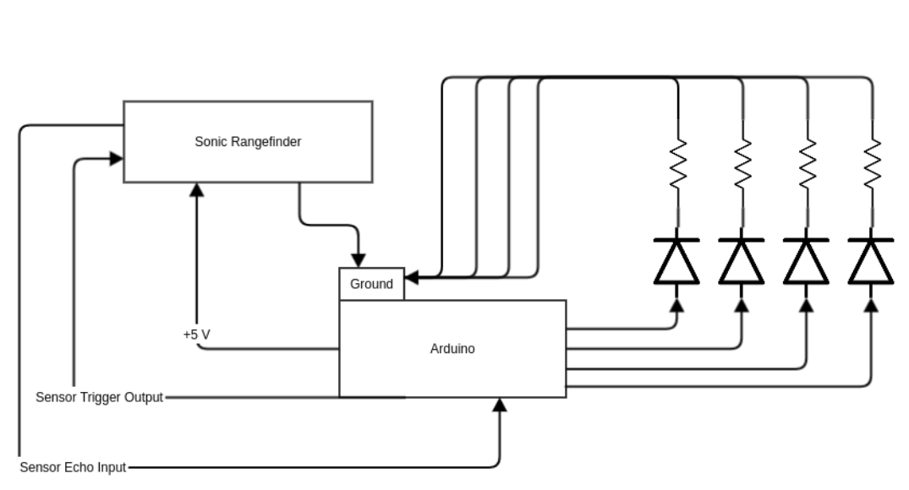

## Hardware

* Elegoo Uno R3 Board w/ USB cable
* Breadboard
* Ultrasonic Rangefinder
* LEDs: red, yellow, green, blue
* 4x 220-ohm resistors
* Jumper Wires

## Circuit Diagram(s)

Hardware diagram made on [TinkerCAD](www.tinkercad.com/learn). TinkerCAD's ultrasonic model does not have separate I/O pins, only a single signal pin, so a few liberties were taken regarding diagramming this setup. ¯\_(ツ)_/¯

(crappy) circuit diagram made with Gliffy Diagrams.
